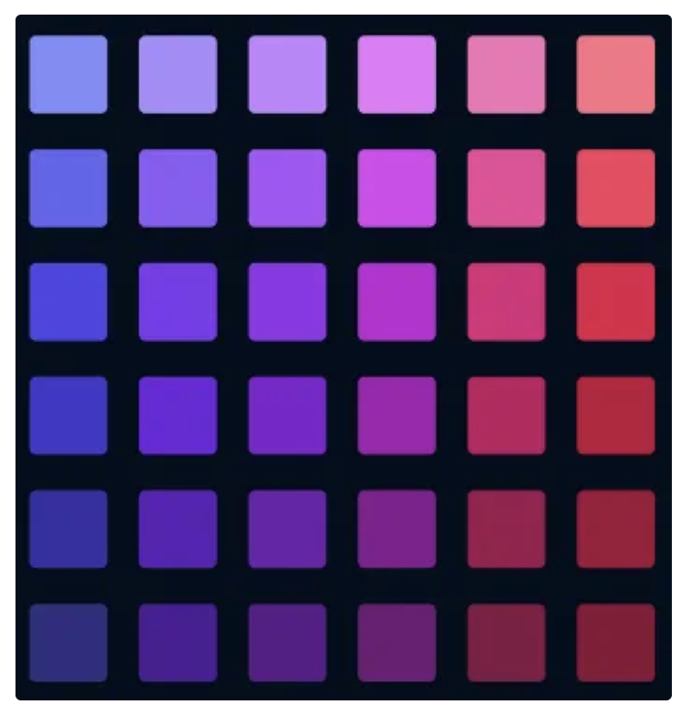

 

# BABY STEPS CSS3

## 🏆 Objetivos

- Introducir en el uso de los estilos básicos de CSS3.

## 🔧 Competencias técnicas

- Maquetación web.

## 🛠️ Herramientas

- Visual Studio Code
- HTML5
- CSS3

## 🪜 Instrucciones

Replica la siguiente imagen haciendo uso de HTML5 y CSS3.

 
